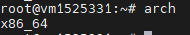
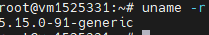
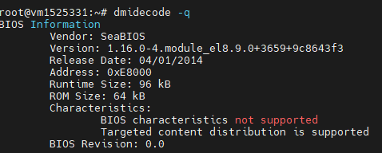
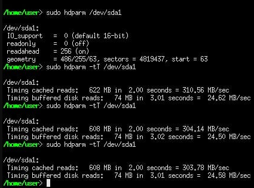
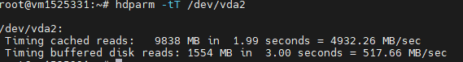
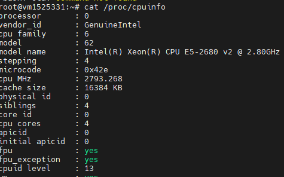

Linux Bash Shell Cheat Sheet

| Command                       | Description                                     |     example           |
|-------------------------------|-------------------------------------------------|-----------------------|
| arch                          |display architecture                             |    |
| uname -m                      |analogue (arch)                                  |    |
| uname -r                      |display the kernel version used                  || 
| dmidecode -q                  |show hardware system components - (SMBIOS \ DMI  ||
| hdparm -i /dev/sda1           |display hard drive characteristics               ||
| hdparm -tT /dev/vda2          |test the performance of reading data from the hd ||
| cat /proc/cpuinfo             |display processor information                    |
|                               |                                                 |
|                               |                                                 |
|                               |                                                 |
|                               |                                                 |
|                               |                                                 |
|                               |                                                 |

